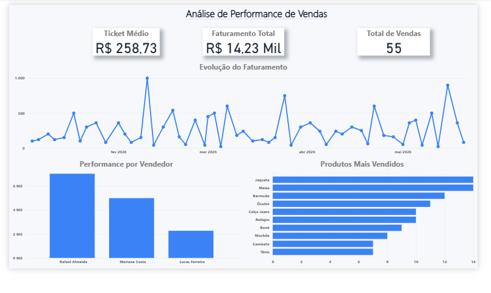

# 📊 Análise de Performance de Vendas

Projeto de análise de dados desenvolvido utilizando **SQL** e **Power BI** para explorar métricas de vendas e gerar insights sobre o desempenho de uma empresa fictícia.

---

## 🎯 Objetivo do Projeto

O objetivo deste projeto é analisar dados de vendas para responder perguntas de negócio importantes, como:

* Qual é o faturamento total da empresa?
* Qual o ticket médio das vendas?
* Quais produtos são mais vendidos?
* Qual vendedor possui melhor desempenho?
* Como o faturamento evolui ao longo do tempo?

---

## 🛠️ Tecnologias Utilizadas

* SQL
* MySQL
* Power BI
* GitHub

---

## 📂 Estrutura do Projeto

analise-de-vendas-sql-powerbi

dashboard/
    dashboard_vendas.pbix

sql/
    criacao_tabelas.sql
    insercao_dados.sql
    consultas_analise.sql

imagens/
    dashboard_vendas.png

README.md

---

## 📊 Dashboard

Abaixo está o dashboard desenvolvido no Power BI para análise dos dados de vendas.

---

## 📈 Principais Análises Realizadas

✔ Faturamento total da empresa
✔ Ticket médio por venda
✔ Evolução do faturamento ao longo do tempo
✔ Performance de vendas por vendedor
✔ Produtos mais vendidos

---

## 💡 Insights Possíveis

Com esse tipo de análise é possível:

* Identificar vendedores com melhor desempenho
* Entender quais produtos geram mais receita
* Acompanhar o crescimento das vendas ao longo dos meses
* Apoiar decisões estratégicas de negócio

---

## 👩‍💻 Autora

**Thaís Albuquerque**

Estudante de Análise e Desenvolvimento de Sistemas com foco em **Análise de Dados**.

---

## 🚀 Próximos Passos

Algumas melhorias que podem ser adicionadas futuramente:

* Adição de filtros interativos no dashboard
* Análise por região ou cidade
* Análise por categoria de produto
* Criação de novas métricas de negócio
